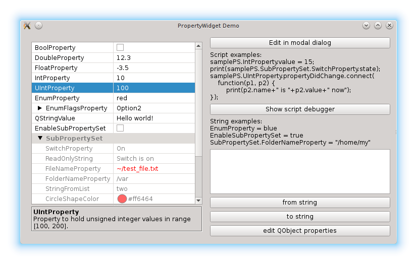
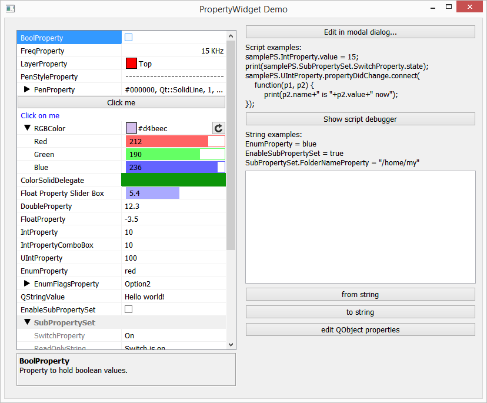
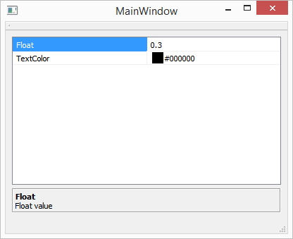

[](https://travis-ci.org/lexxmark/QtnProperty)

# QtnProperty
This is user and programmist friendly properties for Qt framework.
See [wiki](https://github.com/lexxmark/QtnProperty/wiki) for some details.

# Overview
There are some limitations of standard Qt property system.
This project is an attempt to make better properties.
The key features are:

* Properties hierarchy (properties can be organized in hierarchy at any depth)
* Property widget to observe and edit properties in uniform way
* Signals before and after property has changed
* Property description - short text which help user to understand meaning and purpose of the property
* Property state - property can be disabled or hidden at any moment
* Serialization via QDataStream
* Set/Get property value to/from QVariant and QString
* Scripting support
* Delegates to customize look and feel properties in property widget
* PEG (property/enum generator) - it's optional tool like Qt moc which generates properties hierarchy from QML like files into C++ code.

Some screenshots of the Demo application:



# How to build
**Requirements:**

1. Qt 5.2 framework or later
2. Flex 2.6.4 and Bison 3.1.1 (for Windows can be found [here](https://github.com/lexxmark/winflexbison)) if you build QtnPEG tool

**To build:**
  
    mkdir path_to_build
    cd path_to_build
    qmake path_to_QtnProperty/Property.pro -r
    make

Or just open path\_to\_QtnProperty/Property.pro file in Qt Creator and build all.
Generated libraries and executables will be placed into the 'path\_to\_build/bin-[linux|osx|win]' folder.
  
**To run tests and demo:**

    cd path_to_build/bin-[linux|osx|win]
    ./QtnPropertyTests
    ./QtnPropertyDemo

QtnProperty project consists of five submodules:

1. **QtnPropertyCore** static library - property classes (non GUI stuff)
2. **QtnPropertyWidget** static library - QtnPropertyWidget, QtnPropertyView and property delegates (GUI stuff)
3. **QtnPEG** tool - optional executable to generate C++ code for property sets from simple QML like files (*.pef files)
4. **QtnPropertyTests** - tests for QtnPropertyCore library
5. **QtnPropertyDemo** - demo application

# How to use

## Step 1.
To have QtnProperty in your project your should include QtnProperty.pri file into your pro file. It will add QtnPropertyCore and QtnPropertyWidget static libraries to your project.
```C++
    include(QtnProperty\QtnProperty.pri)
```

## Step 2.
Then you can manually create property sets in your C++ code, create QtnPropertyWidget or QtnPropertyView widgets and assign property set to the widget:

```C++
class Ui_MainWindow
{
public:
    QtnPropertyWidget *centralWidget;
    ...
};

MainWindow::MainWindow(QWidget *parent) :
    QMainWindow(parent),
    ui(new Ui::MainWindow)
{
    ui->setupUi(this);

    m_propertySet = new QtnPropertySet(this)

    auto floatValue = qtnCreateProperty<QtnPropertyFloat>(m_propertySet);
    floatValue->setName(tr("Value"));
    floatValue->setDescription(tr("Float value"));
    floatValue->setMaxValue(1.f);
    floatValue->setMinValue(0.f);
    floatValue->setStepValue(0.1f);
    floatValue->setValue(0.3f);

    auto textColor = qtnCreateProperty<QtnPropertyQColor>(m_propertySet);
    textColor->setName(tr("TextColor"));
    textColor->setDescription(tr("Foreground text color"));
    textColor->setValue(QColor(0, 0, 0));

    ui->centralWidget->setPropertySet(m_propertySet);
}
```
This example will show you something like this:



## Step 3.
If you want to use *.pef files to generate properties C++ code you need to build QtnPEG executable.

## Step 4.
To use *.pef files in your project you should do the following in your pro file:

* Define PEG_TOOL variable as full path to the QtnPEG executable
* include PEG.pri file
* list all *.pef files in PEG_SOURCES variable

```C++
PEG_TOOL = $$BIN_DIR/QtnPEG
include(../PEG.pri)
PEG_SOURCES += TextEditor.pef
```

## Step 5.
Write *.pef file with propertyset declaration. See [wiki](https://github.com/lexxmark/QtnProperty/wiki/Property-Enum-file-format-(*.pef)) for more info. For example TextEditor.pef:
  
```C++
#include "Core/PropertyCore.h"

property_set TextEditor
{
    Bool enableWrapping
    {
        description = "Enable/disable text wrapping";
        value = true;
    }
    
    Bool replaceTabsWithSpaces
    {
        description = "Automatically replace tabs with spaces";
        value = false;
            
        slot propertyDidChange
        {
            tabSize.switchState(QtnPropertyStateImmutable, !replaceTabsWithSpaces);
        }
    }
    
    UInt tabSize
    {
        description = "Number of spaces to be placed.";
        state = QtnPropertyStateImmutable;
        value = 4;
    }
}
```
    
## Step 6.
Include generated TextEditor.peg.h and TextEditor.peg.cpp files into 
your project.

## Step 7.
Now you can use QtnPropertySetTextEditor class (defined in generated files) in your C++ code like this:
```C++
    QtnPropertySetTextEditor params;
    params.enableWrapping = false;
    if (params.replaceTabsWithSpaces)
        document.replaceTabsWithSpaces(params.tabSize);
```

Video of GUI testing using Froglogic (c) Squish test framework is [here](https://www.youtube.com/watch?v=lCmM13vPWBU).

# Useful links
The following fork [https://github.com/kusharami/QtnProperty](https://github.com/kusharami/QtnProperty) has some advanced features:

* **Multi-properties with QtnMultipleProperty.** It is useful when you want to show properties of multiple objects at once. When values of objects's properties differ it shows grayed (**Multiple properties**). When you set a new property value, it will be changed in every dependent object. Multi-property set can be created with qtnCreateQObjectMultiPropertySet function defined in [QObjectPropertySet.h](https://github.com/kusharami/QtnProperty/blob/master/QtnProperty/QObjectPropertySet.h) or from custom property sets in a loop with qtnPropertiesToMultiSet function where target argument is a multi-property set, and source argument is a source property set you want to join.
* **QVariant properties with QtnCustomPropertyWidget.** You can edit QVariant as property set / add/remove subproperties in QVariantMap or QVariantList, copy/paste variant properties.
* **Integer 64 properties** QtnPropertyInt64 QtnPropertyUInt64
* **Floating point variants of QPoint, QSize, QRect properties**
* **Overriding QtnPropertyDelegateFactory for QtnPropertySet**
* **Improvements to sync objects values and property editors**
* **Translations EN_RU**


